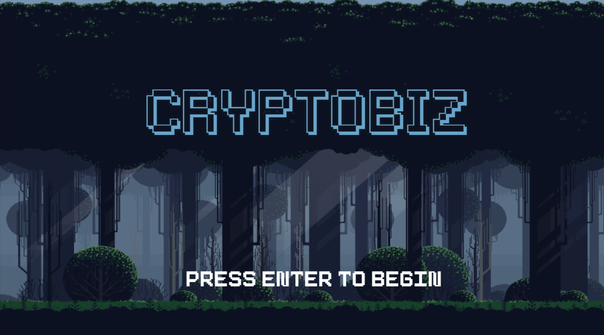
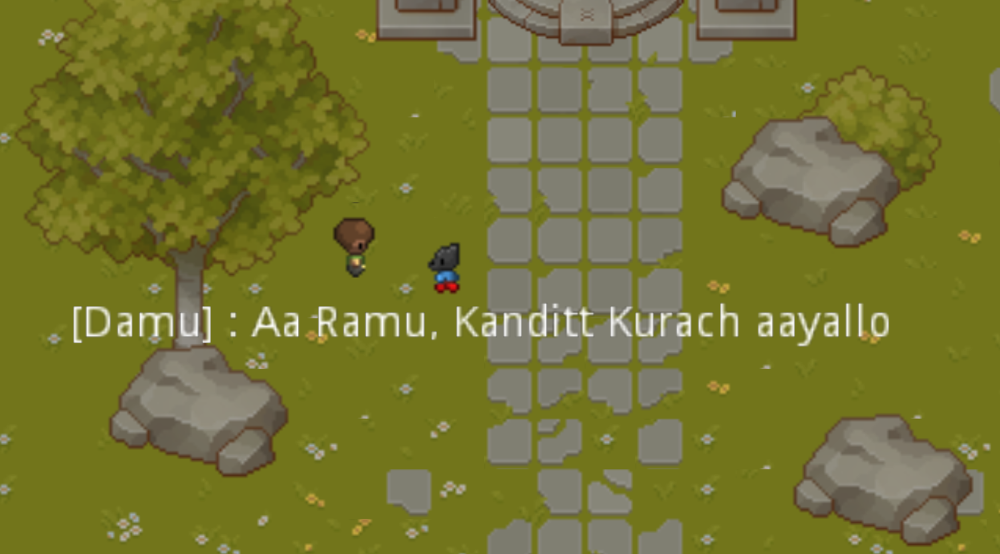

# CryptoBiz

**CryptoBiz** is a 2D top down game created in Godot and is a part of Cryptobiz Projects.
This game is created to provide slight insights of basic cryptographic topics  to the player.
 
<b>NOTE<B>: <b>The Game is in its initial stage of development.<b>
 
  

# Installation
Download release packages for respective OS from [releases](https://github.com/v4zha/cryptobiz/releases) 
# Todo
- fix Interactions
- More visually pleasing
- Add more levels
- Add sounds 
- More interactive and Engaging

Feel free to contribute : )